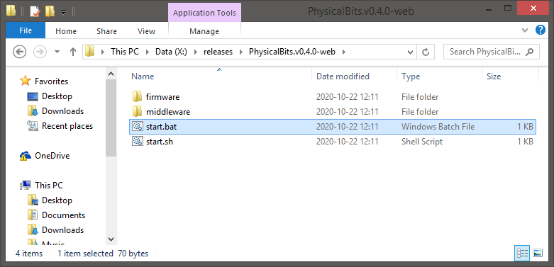
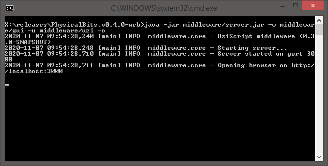
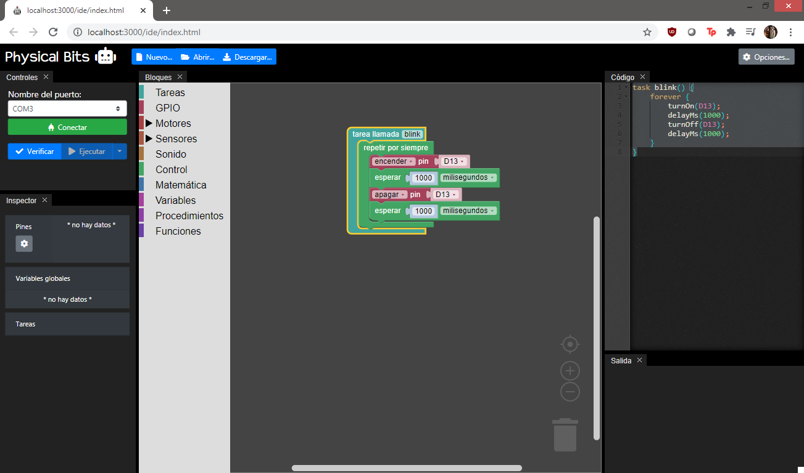
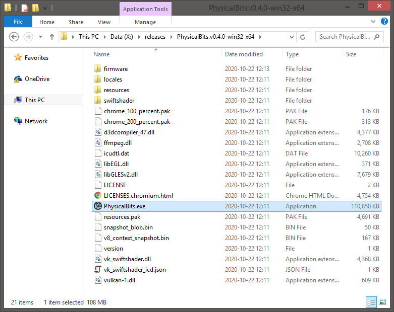
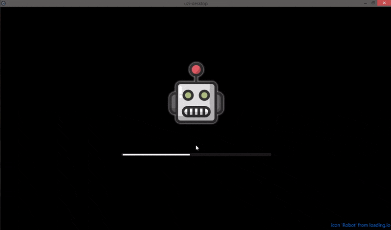
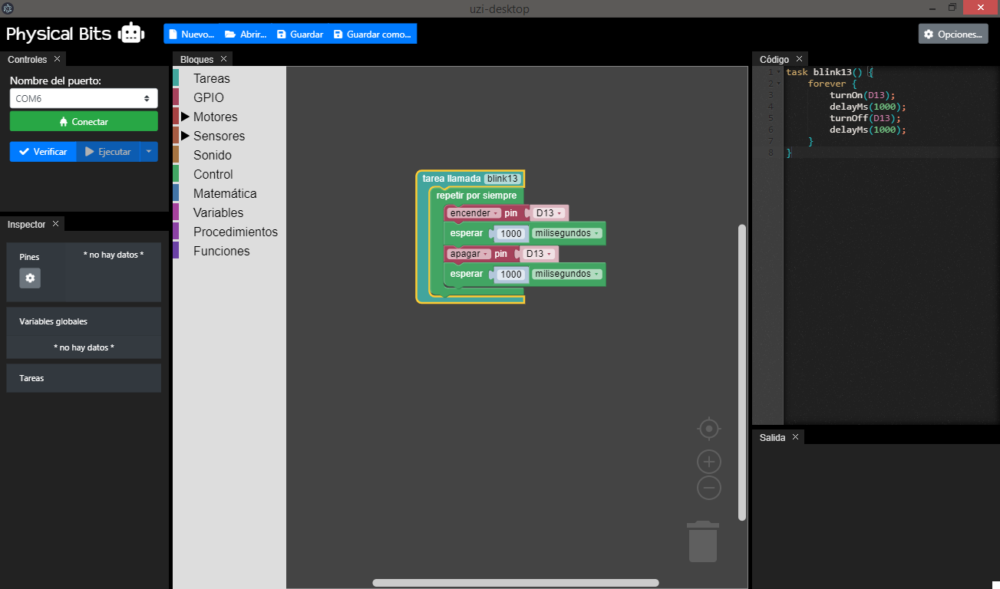

# Download

## Latest release

| Platform | File(s) |
| :---: |:---:|
|  Web | [PhysicalBITS.v0.4.0-web.zip](https://github.com/GIRA/PhysicalBits/releases/download/v0.4.0/PhysicalBITS.v0.4.0-web.zip)   (Cross-platform)|
|  Windows | [PhysicalBITS.v0.4.0-win32-ia32.zip](https://github.com/GIRA/PhysicalBits/releases/download/v0.4.0/PhysicalBITS.v0.4.0-win32-ia32.zip) (32 bits) [PhysicalBITS.v0.4.0-win32-x64.zip](https://github.com/GIRA/PhysicalBits/releases/download/v0.4.0/PhysicalBITS.v0.4.0-win32-x64.zip) (64 bits) |
|  macOS | [PhysicalBITS.v0.4.0-darwin-x64.zip](https://github.com/GIRA/PhysicalBits/releases/download/v0.4.0/PhysicalBITS.v0.4.0-darwin-x64.zip) |

For older versions visit our [releases page](https://github.com/GIRA/PhysicalBits/releases).

## Installation

### Installing Java

Unfortunately, all versions require Java. We're working on removing this dependency but, for now, you'll need it in order to run Physical Bits.

If you already have a version of Java installed on your computer you can skip this step. Otherwise, we recommend you to download and install a version of the [OpenJDK](https://openjdk.java.net/).

### Installing the firmware

In order for Physical Bits to connect to your Arduino board you'll first need to upload the firmware using the [Arduino IDE](https://www.arduino.cc/en/Main/Software).

The `UziFirmware.ino` can be found on the `/firmware` directory inside the zip you just downloaded.

This step needs to be done once for every board you want to use with Physical Bits. We're working on making this step automatic but, for now, you'll need to do it yourself.

__IMPORTANT__: On some boards a "Low memory" warning is displayed after compilation. Don't worry about it, that is by design. The firmware will statically allocate a big chunk of memory to store the user programs at startup. We do this to be able to control how the memory is used and to properly detect and handle memory issues.

## Starting the application

### Web

The web version should work on all platforms.

First, extract the contents of the zip file you've just downloaded into a folder of your preference.

You should see the following files:

Then, if your on Windows just run the `start.bat`. If your on Linux or macOS run the `start.sh`.

You should see a terminal pop up and, after a few seconds, a browser should open with the Physical Bits IDE.

__IMPORTANT__: If, for some reason the IDE doesn't open automatically, you can do it yourself by pointing your browser to [localhost:3000/ide/index.html](http://localhost:3000/ide/index.html).

You can start programming now!

### Desktop

The desktop versions use [electron](https://www.electronjs.org/) to provide a native experience but in the background they run the same server as the web version.

First, extract the contents from the zip file into a folder of your preference.

Depending on your operating system, you should see something like this:

Now, you just have to run the `PhysicalBits.exe` (on Windows) or `PhysicalBits.app` (on macOS).

The following loading screen should appear right away and, after a few seconds of the robot jumping impatiently, the IDE should open.

Have fun programming!
