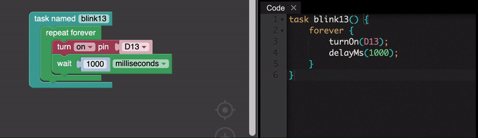
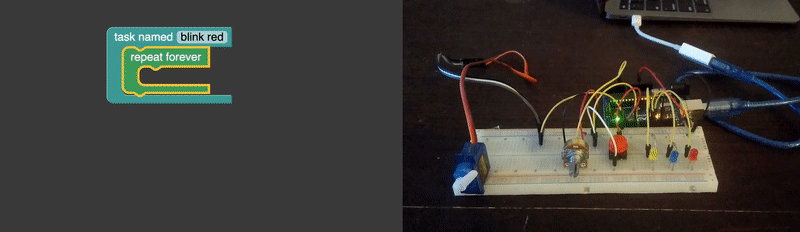
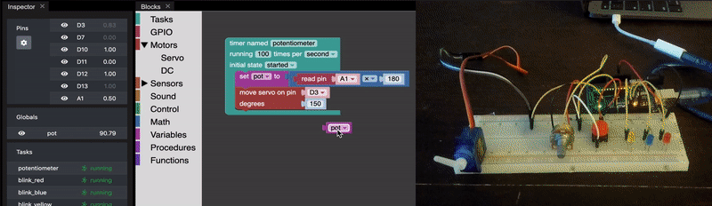
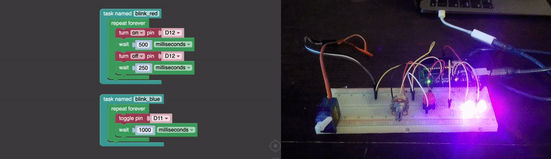
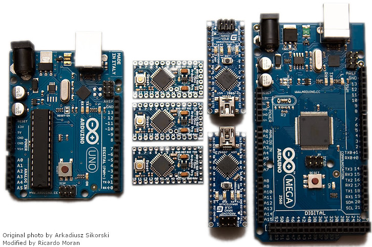

# Key Features

Physical Bits is not a programming environment as any other you may know. It was designed with a set of features in mind that set it apart from other similar tools.

## Block-based and text-based programming

Physical Bits includes a block-based programming language suitable for beginners but it also supports text-based programming for more advanced users. To ease the transition the environment automatically generates the textual code from the blocks (and viceversa).

## Liveness

While the board is connected to the computer Physical Bits allows to inspect and monitor the program state while it runs. Furthermore, every change made to the program can be automatically compiled and transmitted to the robot, which allows to see the effects of the change almost immediately.

## Autonomy

Once you're happy with your program you can store it permanently and unplug your board from the computer. The program will now run autonomously, without requiring a connection to the computer.

## Concurrency

Most educational robotics projects require the implementation of a device that performs two or more simultaneous tasks. Physical Bits allows the definition of concurrent tasks that will be executed independently from each other.

## Debugging

*COMING SOON*

Without debugging tools the process of fixing programming errors can be frustrating for an inexperienced user. UziScript's debugger provides mechanisms for error handling and step-by-step code execution.

## Portability

Although the current implementation only supports Arduino as hardware platform, the firmware is designed with portability in mind.

We have tested the firmware using several different boards, including: [Arduino UNO](https://store.arduino.cc/usa/arduino-uno-rev3), [Micro](https://store.arduino.cc/usa/arduino-micro), [Nano](https://store.arduino.cc/usa/arduino-nano), [MEGA 2560](https://store.arduino.cc/usa/mega-2560-r3), and [Yun](https://store.arduino.cc/usa/arduino-yun-rev-2). We have also received reports of it working successfully on other compatible boards such as [DuinoBot](https://www.robotgroup.com.ar/), [Educabot](https://educabot.com/), and [TotemDUINO](https://totemmaker.net/product/totemduino-arduino/).

We also plan to support other platforms such as [ESP8266](https://en.wikipedia.org/wiki/ESP8266) and [ESP32](https://en.wikipedia.org/wiki/ESP32) in the future.

## Open source

All the code in this project is open source (see [LICENSE](https://github.com/GIRA/PhysicalBits/blob/master/LICENSE)).
