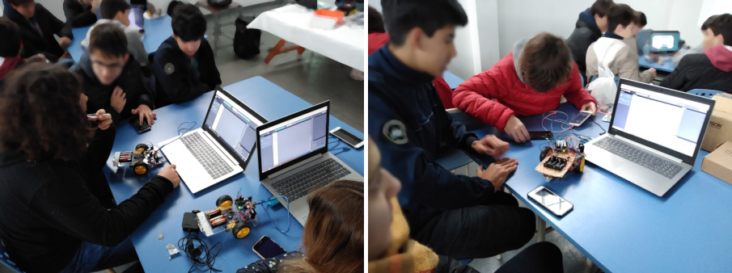
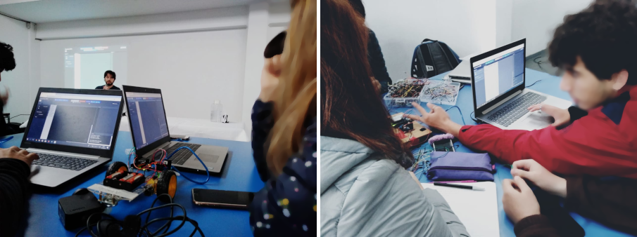

[Physical Bits](https://gira.github.io/PhysicalBits/) (formerly known as UziScript) is the *only* __web-based__ programming environment for __educational robotics__ that supports __live coding__ and __autonomy__ using a __hybrid blocks/text__ programming language.

Want to __learn programming with robots__? You’ve come to the right place! Physical Bits is the *best* tool for that. It is free and open source. Easy to use, simple, and *fun for people of all ages*.

Do you want to know what makes Physical Bits special? See our list of [key features](./getting_started/FEATURES.md) or simply [download it and try it out](./getting_started/DOWNLOAD.md) for yourself.

You can use Physical Bits to build engaging projects using different types of robots. Want to know if your robot kit works with Physical Bits? See the [supported boards](./getting_started/BOARDS.md) for more info.

Happy programming :)

---

Physical Bits was developed by the [GIRA team](./about/README.md).

