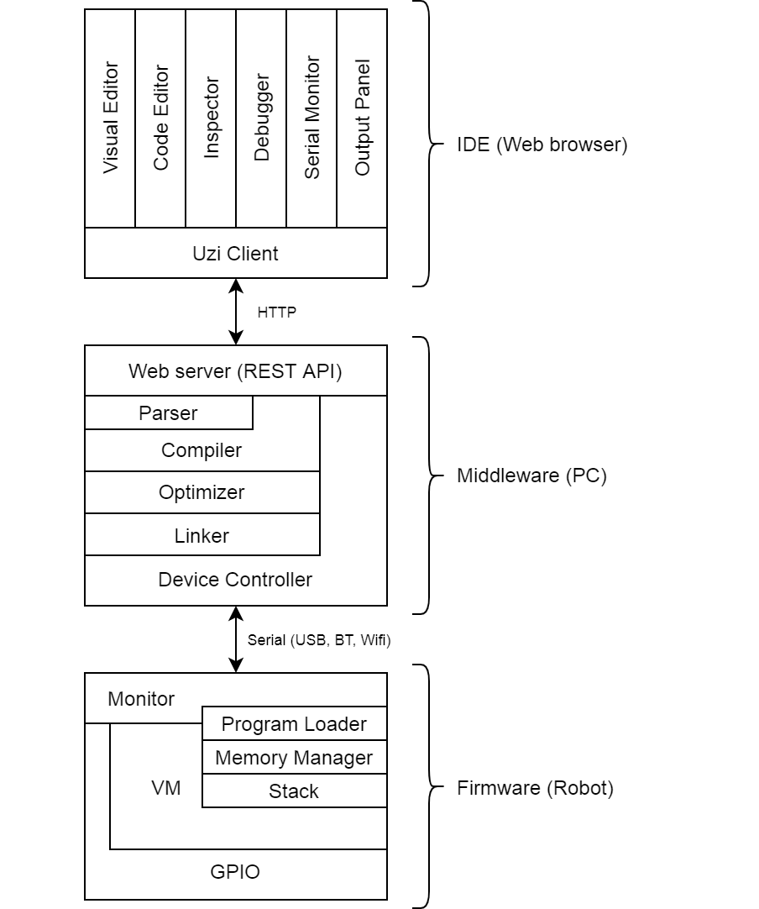
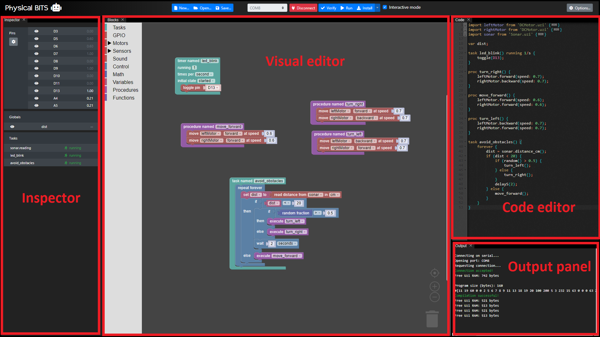
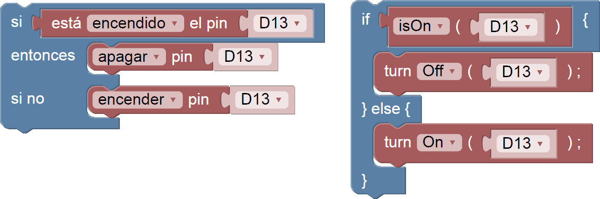
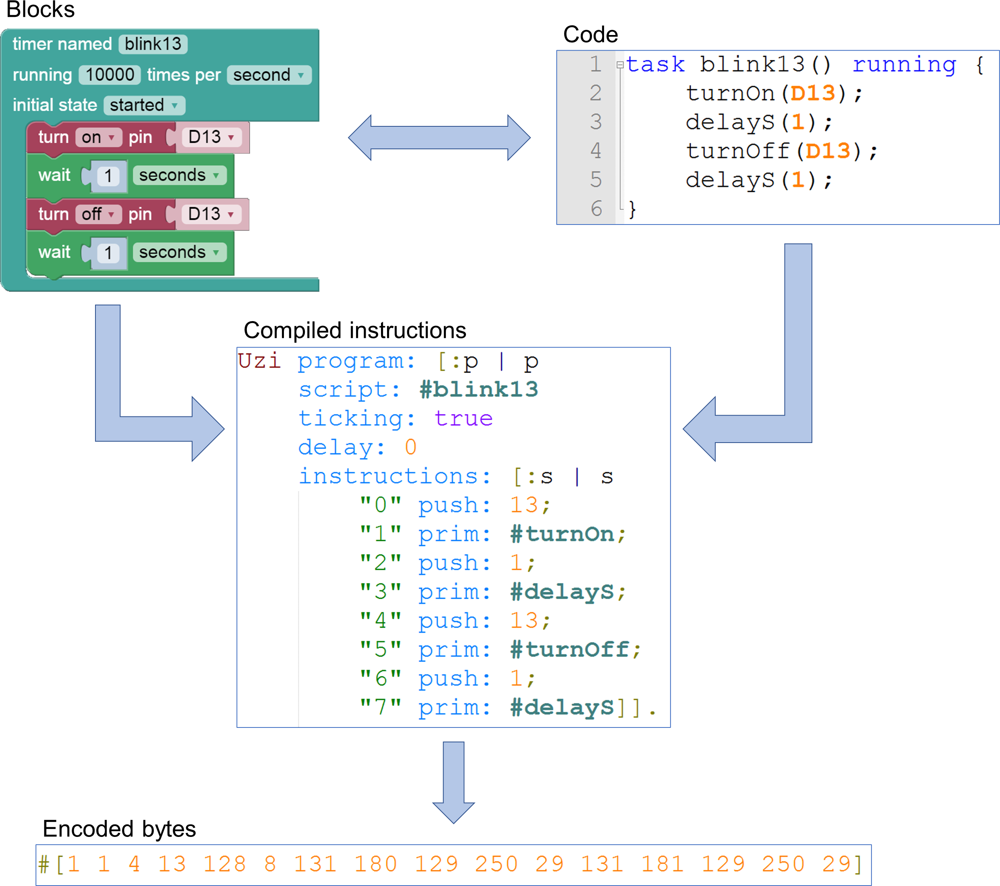
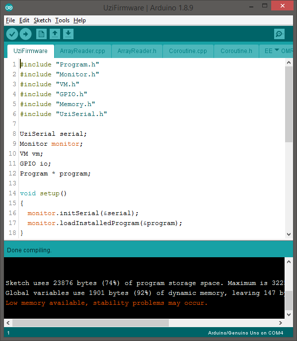
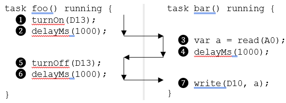

# Physical Bits

[Physical Bits](https://gira.github.io/PhysicalBits/) (formerly known as UziScript) is a web-based programming environment for educational robotics that supports live coding and autonomy using a hybrid blocks/text programming language.

The current implementation supports Arduino as hardware platform. We have tested the firmware using several different boards, including: [Arduino UNO](https://store.arduino.cc/usa/arduino-uno-rev3), [Micro](https://store.arduino.cc/usa/arduino-micro), [Nano](https://store.arduino.cc/usa/arduino-nano), [MEGA 2560](https://store.arduino.cc/usa/mega-2560-r3), and [Yun](https://store.arduino.cc/usa/arduino-yun-rev-2). We have also received reports of it working successfully on other compatible boards such as [DuinoBot](https://www.robotgroup.com.ar/), [Educabot](https://educabot.com/), and [TotemDUINO](https://totemmaker.net/product/totemduino-arduino/).

We also plan to support other platforms such as [ESP8266](https://en.wikipedia.org/wiki/ESP8266) and [ESP32](https://en.wikipedia.org/wiki/ESP32) in the future.

## Table of contents

* [Download](#download)
* [Key Features](#key-features)
  * [Block-based and text-based programming](#block-based-and-text-based-programming)
  * [Liveness](#liveness)
  * [Autonomy](#autonomy)
  * [Concurrency](#concurrency)
  * [Debugging](#debugging)
  * [Portability](#portability)
  * [Open source](#open-source)
* [Motivation](#motivation)
* [Implementation](#implementation)
  * [Architecture](#architecture)
  * [IDE](#ide)
    * [Blocks-based language](#blocks-based-language)
    * [Text-based language](#text-based-language)
  * [Middleware](#middleware)
    * [Compiler](#compiler)
  * [Firmware](#firmware)
    * [Task scheduler](#task-scheduler)

## Download

You can find the latest release [here](https://github.com/GIRA/PhysicalBits/releases).

## Key Features

Physical Bits is not a programming environment as any other you may know. It was designed with a set of features in mind that set it apart from other similar tools.

### Block-based and text-based programming

Physical Bits includes a block-based programming language suitable for beginners but it also supports text-based programming for more advanced users. To ease the transition the environment automatically generates the textual code from the blocks (and viceversa).

### Liveness

While the board is connected to the computer Physical Bits allows to inspect and monitor the program state while it runs. Furthermore, every change made to the program can be automatically compiled and transmitted to the robot, which allows to see the effects of the change almost immediately.

### Autonomy

Physical Bits programs are stored and executed autonomously in the robot without requiring a connection to the computer.

### Concurrency

Most educational robotics projects require the implementation of a device that performs two or more simultaneous tasks. Physical Bits allows the definition of concurrent tasks that will be executed independently from each other.

### Debugging

*COMING SOON*

Without debugging tools the process of fixing programming errors can be frustrating for an inexperienced user. UziScript's debugger provides mechanisms for error handling and step-by-step code execution.

### Portability

Although we currently only support Arduino, we plan to port the VM to other hardware platforms.

### Open source

All the code in this project is open source (see [LICENSE](https://github.com/GIRA/PhysicalBits/blob/master/LICENSE)). If you're interested in contributing to this project see [CONTRIBUTING](./CONTRIBUTING.md).

## Motivation

Most educational programming environments share the same blocks-based programming style. This is not surprising, studies show that visual programming environments help to learn programming by removing the possibility of syntax errors and simplifying the programming language, which allows students to focus on understanding the underlying concepts. However, a common problem we found when teaching using visual programming environments is the eventual transition to text-based languages. Most block-based programming environments don't aid the learner in this transition, instead they are more concerned with hiding the complicated syntax rules.
This has led to a couple of problems:
1. Students tend to think of block-based programming as not "real programming". This perceived lack of authenticity has the potential to damage the language effectiveness as students would prefer to learn what they perceive to be a "real language" such as Java or C++ instead of a "toy language" like Scratch.
2. Students transitioning from a blocks-based programming language to a text-based programming language can suffer from a problem referred to as "syntax overload". Some students feel overwhelmed and frustrated by the strict syntax requirements of the text-based languages.
3. Students could potentially end up acquiring poor programming habits that damage their ability to work successfully with text-based languages.

Additionally, some studies reveal that learning the syntax is not even the main problem because the students only struggle with it at an early stage. Instead, a more challenging aspect of learning programming is to be able to correctly predict the impact that changes to the source code have on the behavior of the program when it is executed. Teaching programming presents a dichotomy that is not easy to grasp for beginners: the source code is explicit and visible while the execution dynamics are implicit and harder to understand.

In order to solve this problem, some studies propose to design educational programming environments in a way that makes the relationship between the source code and its effects more explicit. In this regard, most virtual introductory programming environments provide a feature often described as liveness: allowing to change a program while it is running. In a live programming environment, the users change the program and receive immediate feedback on the effect of the change, without requiring any manual compilation steps and minimizing the time wasted waiting for the code to begin executing. Live programming shortens the feedback loop and encourages experimentation and programming by "Trial & error". Some environments also support monitoring the internal state of the program by showing the value of the variables as well as highlighting the currently executing blocks. Although these features are present in most virtual introductory programming environments, they are rarely seen in environments designed to program physical devices such as robots. And the environments that support live programming usually do so in detriment of the autonomy of the robot, requiring a computer connected at all times in order to run the programs and send the commands to the robot as they are executed. Due to the latency of the communication, these environments are limited to projects that do not require precise timing and cannot be used in many robotics competitions.

This project is our attempt to solve this problems and provide a better programming experience for educational robotics.

## Implementation

### Architecture

To understand how Physical Bits works we need to start by looking at its architecture.

Physical Bits is composed of three distinct components:
1. The IDE: A web based application that serves as a graphical user interface for the entire system.
2. The middleware: A set of tools that allow to compile programs and communicate with the robot.
3. The firmware: A program running on the robot responsible for executing the user programs as well as communicating with the middleware.



This architecture has several benefits. On the one hand it is flexible. The IDE, being a web app, could be used from any device with a web browser, such as a laptop or a mobile phone. It could be installed as a native app or accessed through a web browser. Both the middleware and the firmware are portable: although the only implementation of the latter currently supports Arduino boards, the code could be ported to other types of robots with minimal changes to the middleware and IDE. It is fast: compiling, verifying, and uploading programs using the Physical Bits IDE takes a fraction of the time required to compile an Arduino sketch, mostly because of the small size of the programs. And finally, the communication to the robot can be done wirelessly either using bluetooth or a network socket (although the current implementation has only been tested using a USB cable).

### IDE

The IDE presents a graphical user interface for the different tools provided by the system, including:
1. An editor that allows to build programs by snapping blocks together.
2. A code editor that allows to write programs using a custom programming language for robotics.
3. An inspector that allows to monitor the state of the device pins, the currently running tasks, and the values of the program variables.
4. An output console that notifies the user of any messages
5. (COMING SOON) A debugger that helps the user fix programming errors by allowing to pause and execute the program step-by-step.



#### Blocks-based language

For the blocks-based programming language we decided to take advantage of the [Blockly](https://developers.google.com/blockly) library.
The language was designed to provide both a gentle introduction to programming and a smooth transition to text-based languages.
Apart from allowing the student to work on his programs using either the blocks or the code editor (or both at the same time), we also added an option to display the text of the blocks using code instead of natural language (as suggested [here](https://developers.google.com/blockly/guides/app-integration/best-practices#9_exit_strategy)). When this option is enabled the student is effectively writing code, but the environment allows him to do it by dragging and dropping blocks.



#### Text-based language

The text-based programming language (we call it UziScript) was designed to look syntactically like C, which is familiar to most programmers. We added a few special keywords, though.

The `task` keyword has been added to represent behavior that can be executed periodically at a configurable rate. For example, the following code will declare a task that will toggle the LED on pin 13 every second.

```qml
task blink() running 1/s { toggle(D13); }
```

UziScript does not require any type declarations, so to distinguish a function from a procedure two new keywords are introduced: `func` and `proc`.

```qml
func isOn(pin) { return read(pin) > 0.5; }

proc toggle(pin) {
  if isOn(pin) { turnOff(pin); }
  else { turnOn(pin); }
}
```

A program can have any number of tasks, and each task can be defined with a different interval as well as a different starting state, which can be either `running` or `stopped`. If no starting state is specified the task will run just once and then it will stop. This is especially useful to initialize variables and can be used as a substitute to the Arduino `setup()` function.

The execution of each task at the correct time is performed automatically by the virtual machine [scheduler](#task-scheduler) but the user can invoke certain primitives to start, stop, pause, or resume a given task. Each task execution is independent, it has its own stack, and it shares memory with other tasks through specially defined global variables. This design allows users to write sequential programs in Arduino’s usual style and make them run concurrently without being concerned about the processor scheduling.

Primitive instructions like `delay()` are provided to allow the user to block the executing task for a given amount of time without affecting the rest. Arduino related primitives are also included but in some cases their names and behavior were modified to offer a simplified interface with the hardware. For example, the Arduino `digitalRead()` and `analogRead()` functions are merged into a single primitive function called `read()`, which accepts a pin number and returns a floating-point value that is always in the [0,1] range. If the pin is digital the resulting value can either be 0 or 1 but if the pin is analog the function will normalize its value between 0 and 1. An equivalent implementation of the `write()` procedure is also provided. We believe these small design details make the language more accessible to beginners by providing a concise (and consistent) interface to the hardware.

UziScript also supports external libraries that can extend the primitive functionality of the language. You can find examples [here](/uzi/libraries).

The UziScript grammar, written as a PEG, can be found [here](/docs/uzi.pegjs). However, this grammar is not guaranteed to be up to date with the actual implementation.

### Middleware

The middleware contains a set of tools that allow to compile, debug, and transmit the programs to the robot through a serial connection. All these tools were originally developed using [Squeak](https://squeak.org/), an open source version of [Smalltalk](https://en.wikipedia.org/wiki/Smalltalk). We decided to use Squeak to build the first prototype mainly due to of our love for the language. However, we later ported this code to [Clojure](https://clojure.org/) for performance and ease of deployment. We also wanted to take advantage of [ClojureScript](https://clojurescript.org/) and move part of the compilation process to the browser (this is not fully implemented yet).

In order for the IDE to interact with these tools the middleware exposes a REST API containing endpoints to connect and disconnect from the robot as well as compile, run, and install programs. In order to notify the state of the robot (including sensors, global variables, running tasks, etc.) the middleware uses a websocket connection.

#### Compiler

The compilation process transforms the user programs into bytecode suitable for the virtual machine to execute. Below is an example of a simple program and its different representations.



You can find a detailed description of the instruction set [here](./ISA.md).

### Firmware

In order to support both live and autonomous programming, Physical Bits relies on a firmware responsible for executing the user programs as well as communicating with the middleware.

The firmware is just a regular Arduino sketch written in C++ that can be uploaded using the Arduino IDE.



Internally, the firmware implements a stack-based high-level language virtual machine that uses a decode and dispatch bytecode interpreter to execute user programs. This implementation was chosen mainly because of its simplicity. Since the purpose of this language is educational, performance is not currently considered a high priority.

For now, the stack and global variables are the only available memory to the user program. There is no heap or dynamic memory allocation implemented yet. This allows for simpler virtual machine code and compact object code. Almost all the instructions can be encoded using one byte for both the opcode and its arguments and just a few special instructions (such as branches) require an extra byte.

Apart from the virtual machine, the firmware includes a monitor program that allows to interact with a computer through the serial port. Periodically, this monitor program will send the status of the device and receive commands, allowing the host computer to fully control the virtual machine.

By having these two programs running on the robot Physical Bits can provide an live programming experience with a short feedback loop without sacrificing autonomy. Moreover, the monitor program permits the implementation of debugging tools that allow the user to stop the execution of any task, inspect the value of all the variables, explore the call stack, and execute instructions step by step. These kind of debugging capabilities, which we consider to be essential in an educational context, are only available on the Arduino platform using either extra hardware or the more advanced Arduino Zero.

#### Task scheduler

As most Arduino boards contain a single microcontroller, they can only execute one thread at a time. This means all the tasks defined in the program must share a single processor. The virtual machine, apart from executing the program instructions, is responsible for handling the task scheduling. It decides which task gets executed and when to preemptively interrupt it.

The scheduling strategy is simple, the virtual machine will cycle through the task list scheduling the tasks whose time to run is reached. It will then execute each instruction until a blocking operation occurs, in which case it will interrupt the current task and start executing the next one. Each task will store its execution context (stack, program counter, and frame pointer) in order to be able to later resume the execution from the point where it was interrupted. Some of the blocking operations that will force a context switch include: the `yield` instruction, all the `delay()` procedures, a reverse jump, writing to the serial port when the buffer is full, and reading from the serial port when the buffer is empty.

Below is a simplified example of one of the possible ways the scheduler could interleave the execution of the instructions between two tasks.



This strategy has the advantage of being simple (which is important, considering this is an educational project) and it guarantees that all of the tasks will have a chance to run. However, it does not provide any real-time guarantees. In the future, we might improve the implementation by incorporating a real-time scheduler.
