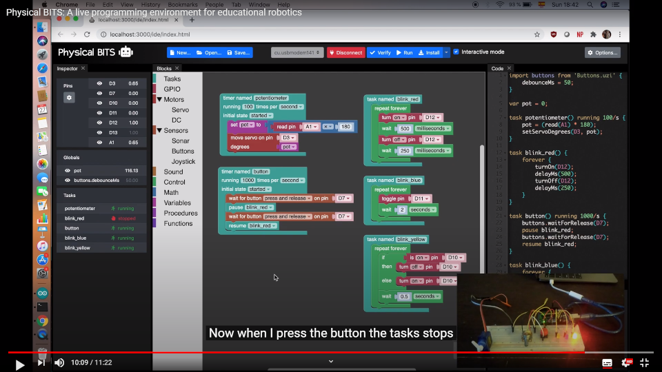

# Physical Bits

[Physical Bits](https://gira.github.io/PhysicalBits/) (formerly known as UziScript) is a web-based programming environment for educational robotics that supports live coding and autonomy using a hybrid blocks/text programming language.

The current implementation supports Arduino as hardware platform. We have tested the firmware using several different boards, including: [Arduino UNO](https://store.arduino.cc/usa/arduino-uno-rev3), [Micro](https://store.arduino.cc/usa/arduino-micro), [Nano](https://store.arduino.cc/usa/arduino-nano), [MEGA 2560](https://store.arduino.cc/usa/mega-2560-r3), and [Yun](https://store.arduino.cc/usa/arduino-yun-rev-2). We have also received reports of it working successfully on other compatible boards such as [DuinoBot](https://www.robotgroup.com.ar/), [Educabot](https://educabot.com/), and [TotemDUINO](https://totemmaker.net/product/totemduino-arduino/).

We also plan to support other platforms such as [ESP8266](https://en.wikipedia.org/wiki/ESP8266) and [ESP32](https://en.wikipedia.org/wiki/ESP32) in the future.

## Download

You can find the latest release [here](https://github.com/GIRA/PhysicalBits/releases).

## Videos

If you want to see Physical Bits in action you can watch this [demo](https://youtu.be/VMX5ltAYxYY). It's recorded in spanish but it has english subtitles.

  
  

You can also watch some old videos in the following [playlist](https://www.youtube.com/playlist?list=PL1aXD47455XPWv4rTXQBuHvamCoNUGeke). These videos are based on an older prototype that is no longer available but I keep them anyway because they show some nice features of the language and virtual machine.

  
  

## Contributing

If you want to contribute to the project please visit the [CONTRIBUTING page](./CONTRIBUTING.md). We are very happy to accept pull requests.

Also, if you find a bug or have a suggestion please file an [issue](https://github.com/GIRA/PhysicalBits/issues).
