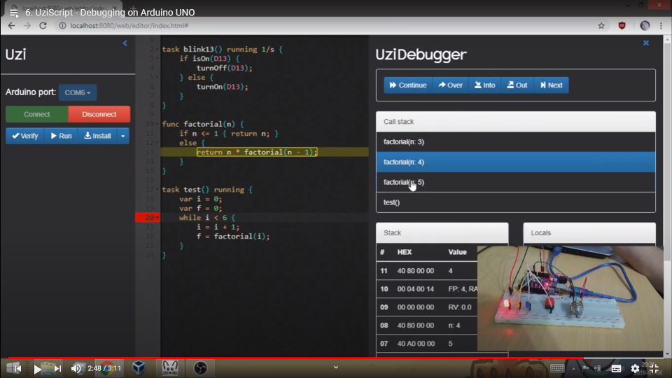

# Videos

If you want to see Physical Bits in action you can watch this [demo](https://youtu.be/VMX5ltAYxYY). It's recorded in spanish but it has english subtitles.

  
  

You can also watch some old videos in the following [playlist](https://www.youtube.com/playlist?list=PL1aXD47455XPWv4rTXQBuHvamCoNUGeke). These videos are based on an older prototype that is no longer available but I keep them anyway because they show some nice features of the language and virtual machine.

  
  

