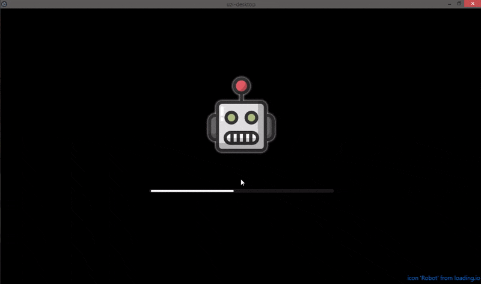

# Physical Bits (Standalone edition)

## Latest release

| Platform | File(s) |
| :---: |:---:|
|  Windows | [PhysicalBits.v0.4.1-desktop-win32.zip](https://github.com/GIRA/PhysicalBits/releases/download/v0.4.1/PhysicalBits.v0.4.1-desktop-win32.zip) |
|  Linux | [PhysicalBits.v0.4.1-desktop-linux.zip](https://github.com/GIRA/PhysicalBits/releases/download/v0.4.1/PhysicalBits.v0.4.1-desktop-linux.zip) |
|  macOS | [PhysicalBits.v0.4.1-desktop-darwin.zip](https://github.com/GIRA/PhysicalBits/releases/download/v0.4.1/PhysicalBits.v0.4.1-desktop-darwin.zip) |

For older versions visit our [releases page](https://github.com/GIRA/PhysicalBits/releases).

## Starting the application

The standalone versions use [electron](https://www.electronjs.org/) to provide a native experience but in the background they run the same server as the web version.

First, extract the contents from the zip file into a folder of your preference.

Depending on your operating system, you should see something like this:

Now, you just have to run the `PhysicalBits.exe` (on Windows) or `PhysicalBits` (on macOS and Linux).

The following loading screen should appear right away and, after a few seconds of the robot jumping impatiently, the IDE should open.

### Installing the firmware

In order for Physical Bits to connect to your Arduino board you'll first need to upload the firmware using the [Arduino IDE](https://www.arduino.cc/en/Main/Software).

The `UziFirmware.ino` can be found on the `/firmware` directory inside the zip you just downloaded.

This step needs to be done once for every board you want to use with Physical Bits. We're working on making this step automatic but, for now, you'll need to do it yourself.

__IMPORTANT__: On some boards a "Low memory" warning is displayed after compilation. Don't worry about it, that is by design. The firmware will statically allocate a big chunk of memory to store the user programs at startup. We do this to be able to control how the memory is used and to properly detect and handle memory issues.

You can start programming now!

## Prerequisites

### Microsoft Visual C++ 2010 Redistributable Package

On Windows you will also need the Visual C++ 2010 Redistributable Package.

If you don't have it already you can download it from [here](https://www.microsoft.com/en-US/download/details.aspx?id=14632).
