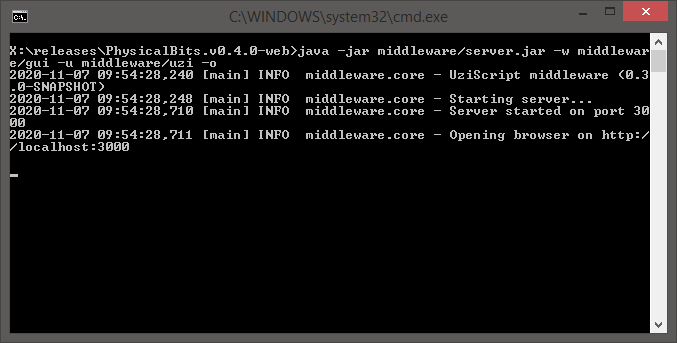

# Physical Bits (Web edition)

## Latest release

| Platform | File(s) |
| :---: |:---:|
|  Windows | [PhysicalBits.v0.6.2-web-win32.zip](https://github.com/GIRA/PhysicalBits/releases/download/v0.6.2/PhysicalBits.v0.6.2-web-win32.zip) |
|  Linux | [PhysicalBits.v0.5.1-web-linux.zip](https://github.com/GIRA/PhysicalBits/releases/download/v0.5.1/PhysicalBits.v0.5.1-web-linux.zip) |
|  macOS | [PhysicalBits.v0.5.1-web-darwin.zip](https://github.com/GIRA/PhysicalBits/releases/download/v0.5.1/PhysicalBits.v0.5.1-web-darwin.zip) |

For older versions visit our [releases page](https://github.com/GIRA/PhysicalBits/releases).

## Starting Physical Bits

First, extract the contents of the downloaded zip file into a folder of your preference.

You should see the following files:

Then, if you're on Windows just run the `start.bat`. If you're on Linux or macOS run the `start.sh`.

You should see a terminal pop up and, after a few seconds, a browser should open with the Physical Bits IDE.

__IMPORTANT__: If, for some reason the IDE doesn't open automatically, you can do it yourself by pointing your browser to [localhost:3000](http://localhost:3000).

Before connecting to your Arduino board, you'll need to upload the firmware. Find instructions [here](../getting_started/FIRMWARE.md).

If you find any problem using Physical Bits, please check our [troubleshooting page](../getting_started/TROUBLESHOOTING.md). If you can't find a solution to your problem please submit an [issue](https://github.com/GIRA/PhysicalBits/issues). Thanks!

Happy programming!
