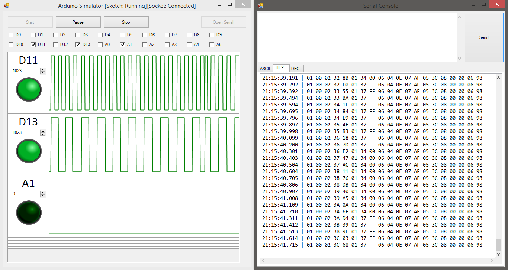
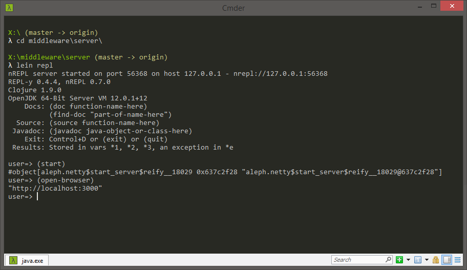
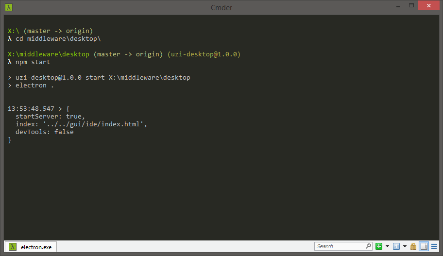

# Contributing

First of all, thank you for your interest in the project. Depending on what you're trying to do you'll need some basic knowledge of C/C++, Clojure, and HTML/Javascript. Below you'll find instructions on how to get started.

## Folder structure

Just to give you a general idea of how the code is organized.

    .
    ├── docs/                    # Documentation files and website (you're here)
    ├── firmware/
    │   ├── Simulator/           # Arduino simulator (useful for testing without an Arduino board)
    │   └── UziFirmware/         # UziScript firmware (an Arduino sketch)
    ├── gui/
    │   ├── ide/                 # The web-based IDE
    │   └── test/                # Some tests for the UI (work in progress)
    ├── middleware/
    │   ├── desktop/             # An electron wrapper to provide a desktop app
    │   └── server/              # The server containing all the compilation tools
    ├── release-builder/         # A node.js app that simplifies the process of building a release
    ├── uzi/
    │   ├── libraries/           # UziScript libraries
    │   ├── tests/               # Tests files
    │   └── uzi.xml              # Notepad++ syntax highlighter
    ├── LICENSE
    └── README.md

## Release builder

This is probably the best place to start if you're not sure of what to do. This is a small node.js app that takes care of compiling all the packages and bundling them all together into a release. If you manage to build a release successfully then that means you have all the dependencies correctly installed.

For more detailed instructions, see here: [/release-builder](https://github.com/GIRA/PhysicalBits/tree/master/release-builder).

## Firmware

For the firmware, since it is a simple Arduino sketch, you only need the [Arduino IDE](https://www.arduino.cc/en/Main/Software). However, to make development easier we also use Visual Studio with a very simple Arduino simulator we developed for this project. The simulator is extremely limited so it's not exactly the same as compiling for the Arduino but it makes things a lot easier especially when it comes to debugging and testing.

The source code for the UziScript firmware can be found here: [/c++/UziFirmware](https://github.com/GIRA/PhysicalBits/tree/master/firmware/UziFirmware).

If you also want to use the simulator with the Visual Studio IDE you can find the solution here: [/c++/Simulator](https://github.com/GIRA/PhysicalBits/tree/master/firmware/Simulator). I've been using Visual Studio 2019 without problems.

## Middleware

The middleware contains a small set of tools that allow to compile, debug, and transmit the programs to the Arduino board through a serial connection. In order for the IDE to interact with these tools the middleware is implemented as a web server that exposes a REST API. We have also implemented an electron wrapper that allows us to provide a desktop experience. This electron wrapper simply starts the server as a background process and displays the IDE inside an electron window.

The source code for the middleware server as well as more detailed instructions on how to start the server can be found here: [/middleware/server](https://github.com/GIRA/PhysicalBits/tree/master/middleware/server).

The source code for the electron wrapper can be found here: [/middleware/desktop](https://github.com/GIRA/PhysicalBits/tree/master/middleware/desktop).

## GUI

All the web tools are written in plain html and javascript. By default, the middleware server takes care of hosting these files but you can host them in any way you want as long as the middleware server is accessible and running.

You'll find the source code in here: [/gui](https://github.com/GIRA/PhysicalBits/tree/master/gui).
